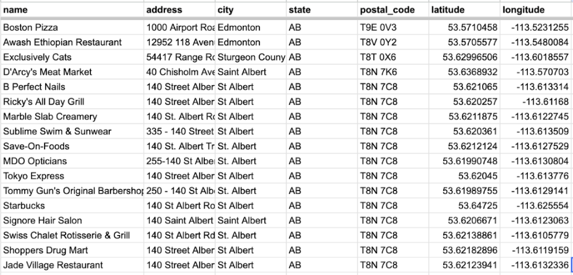
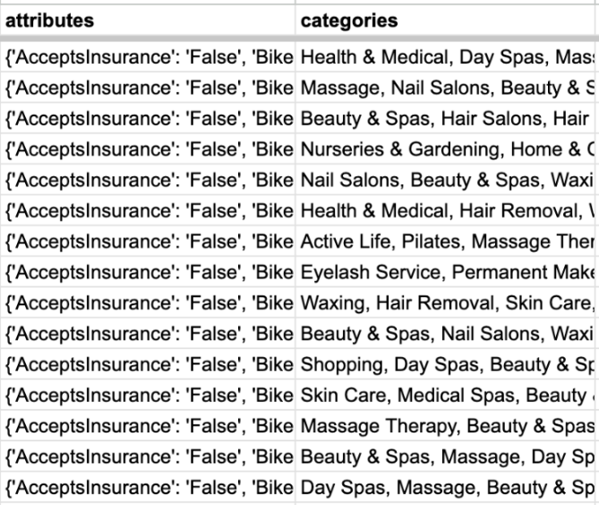
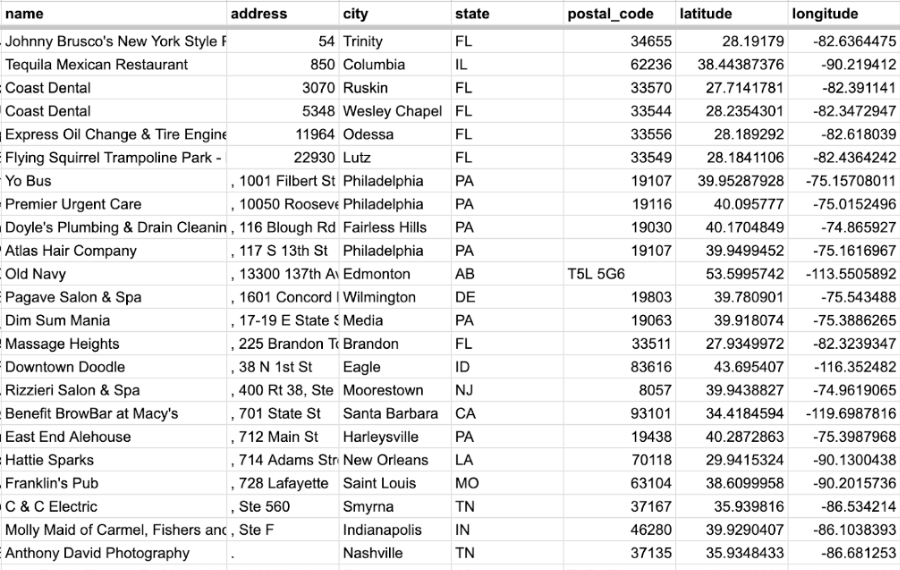
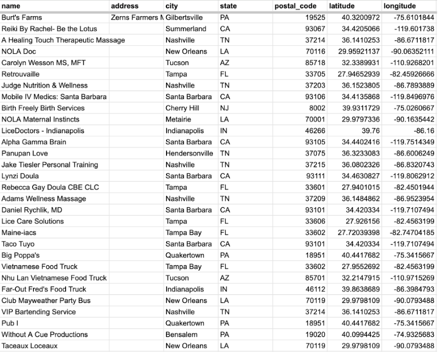
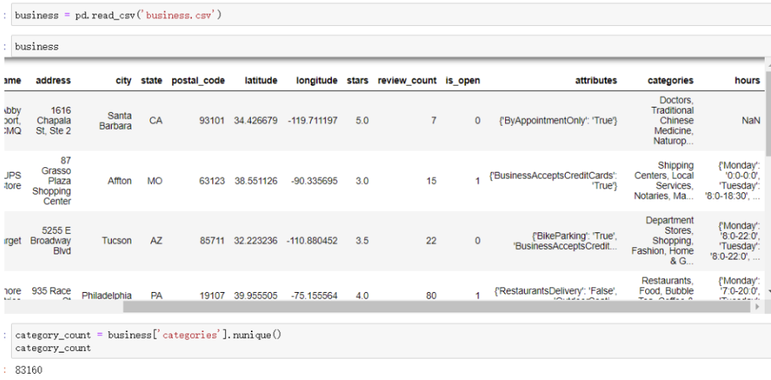
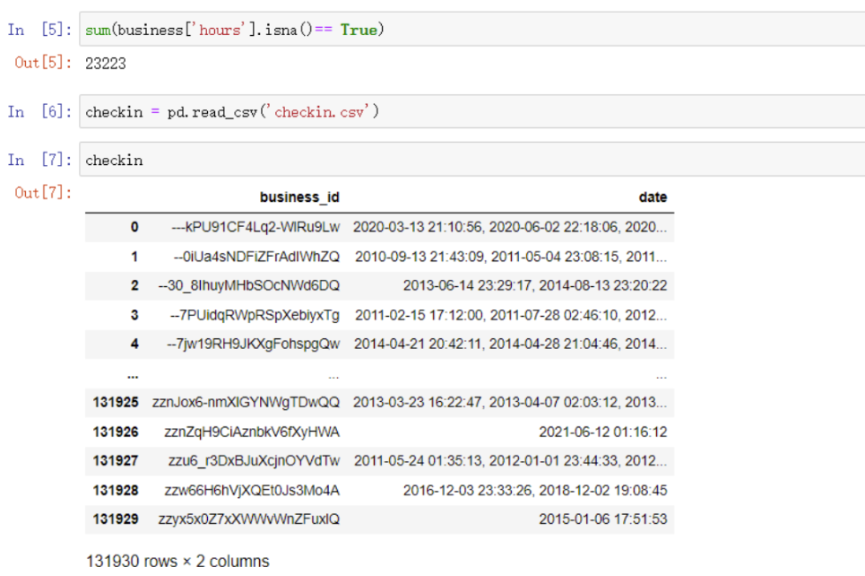
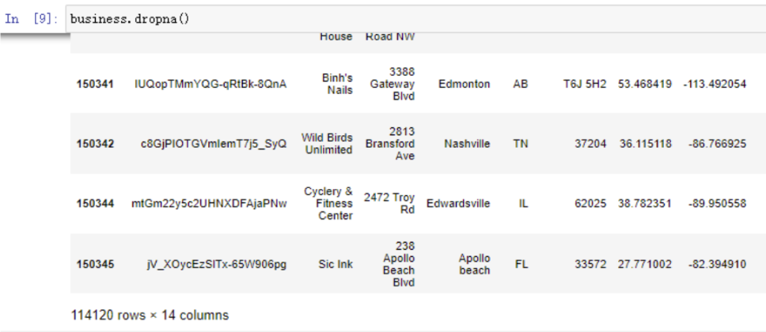
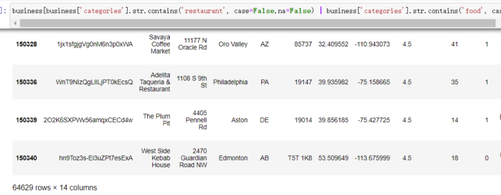
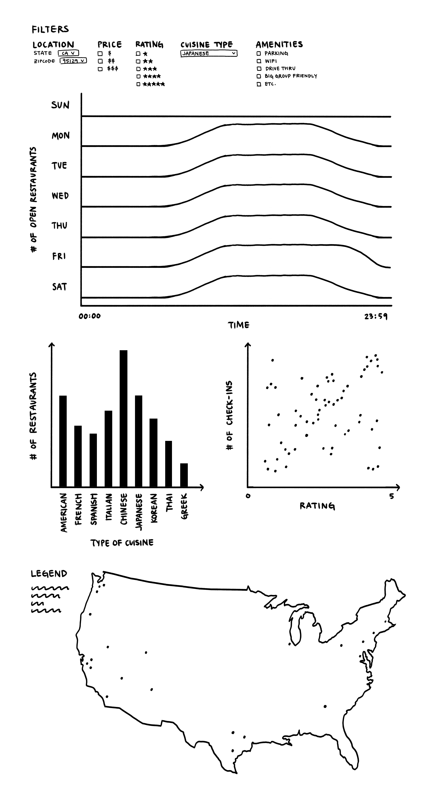
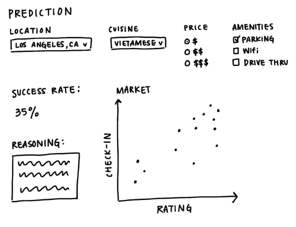

# Final Project Proposal

**GitHub Repo URL**: [Github Repo Link](https://github.com/CMU-IDS-Spring-2024/final-project-team6.git)

## Team members

Cici Feng, Claire Li, Hao Wang, Margaret Lu

## Problem

In today's competitive market, many restaurants open only to close shortly thereafter. It is crucial for restaurant owners to have a clear understanding of the optimal location for their establishment and the strategies for success ahead of time. To address this issue, effective visualizations and predictive models can be invaluable tools. Our project aims to assist potential restaurant owners by offering comprehensive insights into the competitive landscape and market dynamics of specific locations.

So the problem that we will ask is: 

**How can we help business owners understand the demographics of the location and estimate the success of the business?**

## Data Description

The main dataset we’ll be using would be the Yelp dataset, specifically the “business” dataset and the “checkin” dataset. These datasets are integral to understanding the operational dynamics, customer engagement, and overall performance of various businesses.  Regarding the sizes of the datasets, the 'business' dataset comprises 150,346 rows and 14 columns, while the 'checkin' dataset consists of 131,930 rows and 2 columns. Here is a brief description of each:

**Business Dataset:** The "business" dataset is a comprehensive collection of data points related to individual businesses. It includes vital information such as business identifiers, names, geographical locations (latitude and longitude), addresses, and operational states (open or closed). Furthermore, it encompasses a wide array of attributes detailing the services offered, operational hours, and customer ratings (stars). The dataset also categorizes businesses into types or sectors, providing a clear view of the business landscape.

**Check In Dataset:** The "checkin" dataset captures customer check-ins at various businesses, offering insights into customer visit patterns and popularity. Each record in this dataset associates customer check-in events with specific businesses, identified by their unique business identifiers. This dataset is pivotal for analyzing foot traffic, peak hours, and overall customer engagement levels across different times and days, offering a dynamic perspective on business activity.

**Additional Dataset:** To enrich our analysis and provide more nuanced insights, we propose incorporating the dataset on estimates of poverty and income of each state and county for 2022 in the United States as a supplementary data source: (https://www.census.gov/data/datasets/2022/demo/saipe/2022-state-and-county.html). This dataset will allow us to explore and understand the relationship between business success and average annual income.

## Solution

The project will deliver exploratory data visualizations such as charts and maps, that depict current restaurant information including types of cuisine, customer ratings, and geographic distribution. Furthermore, we will also develop a machine learning model to assist in predicting the restaurant's success.

With this model, we will take the user input on the characteristics of the restaurant like location, cuisine category, parking and takeout availability and operating hours. 

And we can predict:

1. **Customer Demographic** - Population characteristics that can help tailor a restaurant’s marketing strategy
2. **Market Segmentation** - Customer characteristics including preferences and behaviors
3. **Competitive Landscape Assessment** - What type of restaurants are successful in the environment
4. **Foot Traffic** - Information to help optimize staffing, inventory management, and marketing to coincide with peak visitation times

Which ultimately decides the success probability to help a business owner decide what kind of restaurant they want to open in the future in a specific location. With an oversaturated market, success is determined on understanding the target market, which comes from data-driven decisions. By utilizing Yelp’s dataset, coupled with trends and patterns discovered throughout the process, insights can be generated, which can determine the success or failure of the restaurant.

## Next Steps

**ML Predictive Model Development:**

1. Data Cleaning and Preprocessing: Prepare the datasets for analysis by cleaning and engineering features that are indicative of restaurant success.
2. Exploratory Data Analysis (EDA): Conduct EDA to understand trends, patterns, and outliers in the data. Use visualizations to map the distribution of restaurants and identify areas with high potential for new ventures.
3. Model Selection and Training: Choose suitable ML algorithms (e.g., regression analysis for traffic prediction, clustering for market segmentation) and train them on the Yelp datasets.
4. Model Evaluation: Assess model performance using appropriate metrics, adjusting parameters and algorithms as necessary to improve accuracy.

**Potential Integrating Census Data:**

1. Data Preparation: Obtain the latest U.S. Census Bureau data on poverty and income estimates for each state and county.
2. Data Integration: Merge this census data with the Yelp datasets, ensuring alignment on geographical identifiers. This integration lets us include median family income and population density in prediction models.
3. Analysis Enhancement: Refine the predictive models to add socioeconomic data to account for the target area's economic viability and competitive landscape.

## Appendix: Detailed Dataset Information

**Table1 business:**

<table>
  <tr>
   <td><strong>Feature</strong>
   </td>
   <td><strong>Type</strong>
   </td>
   <td><strong>Description</strong>
   </td>
   <td><strong>Example</strong>
   </td>
  </tr>
  <tr>
   <td>business_id
   </td>
   <td>string
   </td>
   <td>A unique 22-character string identifier for the business
   </td>
   <td>tnhfDv5Il8EaGSXZGiuQGg
   </td>
  </tr>
  <tr>
   <td>name
   </td>
   <td>string
   </td>
   <td>The name of the business
   </td>
   <td>Garaje
   </td>
  </tr>
  <tr>
   <td>address
   </td>
   <td>string
   </td>
   <td>The full address of the business
   </td>
   <td>475 3rd St
   </td>
  </tr>
  <tr>
   <td>city
   </td>
   <td>string
   </td>
   <td>The city where the business is located
   </td>
   <td>San Francisco
   </td>
  </tr>
  <tr>
   <td>state
   </td>
   <td>string
   </td>
   <td>2 character state code, if applicable
   </td>
   <td>CA
   </td>
  </tr>
  <tr>
   <td>postal code
   </td>
   <td>string
   </td>
   <td>The postal code
   </td>
   <td>94107
   </td>
  </tr>
  <tr>
   <td>latitude
   </td>
   <td>float
   </td>
   <td>Latitude
   </td>
   <td>37.7817529521
   </td>
  </tr>
  <tr>
   <td>longitude
   </td>
   <td>float
   </td>
   <td>Longitude
   </td>
   <td>-122.39612197
   </td>
  </tr>
  <tr>
   <td>stars
   </td>
   <td>float
   </td>
   <td>Star rating, rounded to half-stars
   </td>
   <td>4.5
   </td>
  </tr>
  <tr>
   <td>review_count
   </td>
   <td>integer
   </td>
   <td>Number of reviews
   </td>
   <td>1198
   </td>
  </tr>
  <tr>
   <td>is_open
   </td>
   <td>integer
   </td>
   <td>0 or 1 for closed or open, respectively
   </td>
   <td>1
   </td>
  </tr>
  <tr>
   <td>attributes
   </td>
   <td>object
   </td>
   <td>Business attributes to values (some values might be objects)
   </td>
   <td>{ "RestaurantsTakeOut": true, "BusinessParking": {"garage": false, "street": true, "validated": false, "lot": false, "valet": false } }
   </td>
  </tr>
  <tr>
   <td>categories
   </td>
   <td>array of strings
   </td>
   <td>An array of business categories
   </td>
   <td>["Mexican", "Burgers", "Gastropubs"]
   </td>
  </tr>
  <tr>
   <td>hours
   </td>
   <td>object
   </td>
   <td>An object of key day to value hours, using a 24hr clock
   </td>
   <td>{"Monday": "10:00-21:00", "Tuesday": "10:00-21:00", "Friday": "10:00-21:00", "Wednesday": "10:00-21:00", "Thursday": "10:00-21:00", "Sunday": "11:00-18:00", "Saturday": "10:00-21:00"}
   </td>
  </tr>
</table>

**Table2 Checkin**

<table>
  <tr>
   <td>Field
   </td>
   <td>Type
   </td>
   <td>Description
   </td>
   <td>Example
   </td>
  </tr>
  <tr>
   <td>business_id
   </td>
   <td>string
   </td>
   <td>A unique 22-character string identifier for the business, mapping to the 'business' dataset.
   </td>
   <td>"tnhfDv5Il8EaGSXZGiuQGg"
   </td>
  </tr>
  <tr>
   <td>date
   </td>
   <td>string
   </td>
   <td>A comma-separated list of timestamps for each check-in, each with format YYYY-MM-DD HH:MM:SS.
   </td>
   <td>"2016-04-26 19:49:16, 2016-08-30 18:36:57, 2016-10-15 02:45:18, 2016-11-18 01:54:50, etc."
   </td>
  </tr>
</table>

## Sketches and Data Analysis

### Data Processing

**Data Cleanup**
* Business data csv has a lot of postal codes that do not match the five digit number that is commonly used in the US, and that’s because many of the businesses are in Canada, we need to filter on the data to make it represent the area that we are interested in for this project.

* Many of the businesses are not restaurants, we need to filter the data to only keep restaurants and remove the unnecessary categories like AcceptsInsurance because restaurants don’t need insurance.

* Potential lack of address on food trucks could impact the data depending on the quantity, if there isn’t a lot we can remove the row. Or we can use latitude and longitude to identify the location instead of address

* Since we need information from both datasets, we need to join the business table with the checkin table on business id

**What quantities do you plan to derive from your data?**

- **Customer Engagement Metrics**: From the "checkin" dataset, calculate the average number of check-ins per business to gauge popularity and engagement levels. This can also include peak times for customer visits.

- **Business Density and Distribution**: Analyze the geographic distribution of restaurants using the latitude and longitude data from the "business" dataset. This will help in identifying areas with high restaurant density and potential underserved areas.

- **Category and Cuisine Popularity**: Derive the most popular categories and cuisines in different locations by analyzing the "categories" field. This can highlight market saturation or opportunities for niche markets.

- **Ratings and Reviews Analysis**: Aggregate and analyze ratings and review counts from the "business" dataset to understand customer satisfaction and its correlation with business success.

- **Operational Status**: Calculate the proportion of businesses that are open versus those that have closed, providing insights into business survival rates.

- **Service and Feature Trends**: From the "attributes" field, identify trends in services offered by successful restaurants (e.g., takeout availability, parking options) to understand what features contribute to a restaurant's success.

- **Success Prediction Factors**: Use machine learning to identify key factors that predict restaurant success, combining Yelp data with census data.

- **Competitive Landscape Analysis**: Evaluate the types of restaurants that are successful in different demographic and economic environments, identifying gaps in the market.

- **Market Segmentation**: Segment the market based on customer preferences, behaviors, and demographic characteristics to identify target groups most likely to frequent a restaurant.

- **Foot Traffic Prediction**: Develop predictive models to forecast foot traffic based on time, location, and demographic factors, aiding in staffing.

**How will data processing be implemented?**

* Data cleaning and standardization to ensure data quality by removing duplicates, handling missing values, and standardizing formats
  * Identify and remove duplicate records in the Yelp datasets
  * Fill in or remove missing values based on the column (e.g., missing addresses might be dropped, missing ratings could be filled with the average).
  * Standardize text and numeric formats, ensuring consistency (e.g., all postal codes follow the same format).

* Feature extraction to derive meaningful attributes that could influence the predictive model outcomes.
  * Extract time-related features from operational hours to categorize restaurants by their time of operation (e.g., breakfast, lunch, dinner).
  * Parse the `categories` field to extract and classify restaurants by cuisine type.
  * Develop new features that may impact success, such as a boolean for parking availability or a count of nearby competitors.

* Exploratory data analysis (EDA) to gain insights into the data through visualizations and summary statistics, guiding further analysis and model development.
  * Visualize the geographic distribution of restaurants to identify densely populated areas and potential market gaps.
  * Analyze the popularity of different cuisines and restaurant types.
  * Find out how restaurant success measures (e.g., ratings, review counts) and operational features (e.g., hours, attributes).
* Preparation for machine learning models to predict restaurant success.
  * Encode categorical variables using techniques like one-hot encoding.
  * Normalize or standardize numerical features to ensure models aren't biased by the scale of the data.
  * Partition the data into separate training and testing sets to assess the performance of the model.
* Development of predictive models.
  * Select appropriate models based on the nature of the data and prediction goals (e.g., regression models for continuous outcomes like ratings, classification models for binary outcomes like success/failure).
  * Train models on the training dataset, tuning hyperparameters to optimize performance.
  * Validate model performance using the testing set and metrics relevant to the problem (e.g., accuracy for classification, RMSE for regression).

### System Design
#### Display of Data
The data will be displayed in a series of charts, graphs, and maps to illustrate the important factors that are needed in building a successful restaurant.

One important graph that could influence the success rate would be the count of total types of cuisine. If there is one category that is significantly lower than the others, it could be a reasonable hypothesis to start a restaurant with said cuisine. Another important factor would be looking at the rating and number of check-ins to see how currently successful restaurants are operating. 

A map is also important to see the correlation between restaurant types in a specific area and how successful they are in comparison to other regions. 

* Filter system filtering attributes
  * Parking
  * Drive thru
  * Outdoor seating
  * Restaurant good for groups
  * Wifi
  * Reservations
  * Accept credit cards
  * etc.
* Timeline chart
  * Showcasing when restaurants are opened based on filters
* Bar charts and scatter plots
  * Comparing the number of restaurants with the type of cuisine to determine the market competition
  * Comparing the number of check-ins with the rating to determine what type of restaurants are successful
* Map
   * Comparing restaurants in the area as needed based on the filters possible to determine market competition from a geographic standpoint

#### Interaction of Data
* Filter system: The user will be able to filter the data displayed by interacting with the filter system that we provide either in a format as drop down menu.
* Tooltip: When users hover over the data displayed on the graph, for example, a dot on the scatter plot, there will be a text box that shows the information about this piece of data.
* ML Prediction: The system will take the user's description about the restaurants as input and show a success prediction score.

### Sketches

