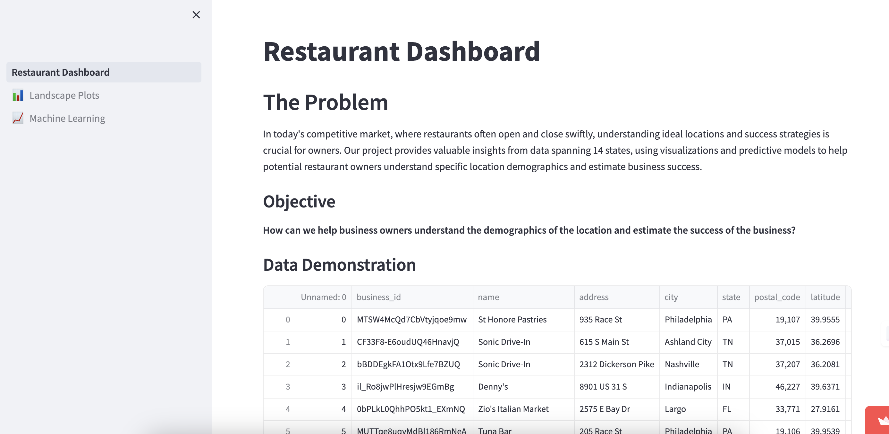

# CMU Interactive Data Science Final Project - MarketScope: Restaurant Viability Analyzer

## Team members:
- Cici Feng: peiwenf@andrew.cmu.edu
- Claire Li: zixinli@andrew.cmu.edu
- Hao Wang: haowang4@andrew.cmu.edu
- Margaret Lu: margarel@andrew.cmu.edu

## Summary Image

The "Restaurant Dashboard" provides an at-a-glance understanding of our project, succinctly outlining the core challenge, our objective, and a sneak peek at the data we're analyzing. It's the starting point for users to delve deeper, with the 'Landscape Plots' offering detailed visualizations of the dataset for nuanced insights, and the 'Machine Learning' tab hosting our predictive tool, ready to assess potential restaurant success. This dashboard is designed to be both informative and interactive, allowing users to engage with the data and predictions that can help guide strategic business decisions in the competitive restaurant industry.

## Abstract
In the highly competitive restaurant business, success depends on many things, including picking the right spot and having a deep understanding of how the market works. MarketScope: Restaurant Viability Analyzer is a state-of-the-art analysis tool that gives user who want to open a restaurant important information about these things. Our project uses the large Yelp dataset, which has specific information on businesses and customers who have checked in, to combine data on customer demographics, market segmentation, and the competitive scene to give a more complete picture of possible business locations.

MarketScope uses advanced data visualization methods and machine learning models to not only visualize how many customers will come in and what demographics will be most likely to buy, but it also looks at the competition to predict how well a restaurant will do. MarketScope uses interactive maps, charts, and predictive scores to give personalized advice that helps potential owners make choices based on data. This helps them improve their business plans and increase their chances of success in a market that is already very crowded.

## Link to Paper
[Full Project Paper](Report.md)

## Video Demo
[Project Video Demo](https://youtu.be/G2CPzgFBIfU)

## Running Instructions
### Data Download
To use the cleaned data directly, please use the `clean_data.csv` file in the `data` folder.
Due to GitHub's limitation of not allowing files larger than 100MB to be uploaded, you can download `.json` `.csv` files of raw data from the url provided in the `dataset url.md` file located in the `data` folder.
### Prerequisites
Before you begin, ensure you have Python installed on your system. Python 3.11.7 is recommended. You can download Python from [python.org](https://www.python.org/downloads/).
To run the application locally, follow these steps:
1. Ensure Python and necessary packages are installed:
   ```bash
   pip install streamlit==1.33.0
   pip install pandas==2.0.1
   pip install altair==5.0.1
   pip install scikit-learn==1.2.2
   ```
2. Clone the repository:
   ```bash
   git clone https://github.com/CMU-IDS-Spring-2024/final-project-team6.git 
   ```
3. Run the application:
   ```bash
   streamlit run Restaurant_Dashboard.py
   ```

## Application Link
[MarketScope: Restaurant Viability Analyzer](https://restaurantdashboard.streamlit.app/)

## Additional Materials
- [Project Proposal](Proposal.md)

## Work distribution

**Cici Feng**
- **Data Visualization**: Created line charts and geographic maps for effective data visualization.
- **Write-up**: Wrote the Methods and Results sections, which explain the line charts and maps and the analyses' results.
- **Video Demonstration**: Created and narrated a film demonstrating the project's features and functioning.

**Claire Li**
- **Machine Learning Dashboard**: Developed and optimized machine learning models for analytics in the development of the Machine Learning Dashboard.
- **ML Visualization**: Created machine learning output graphics to improve model prediction understanding.
- **Readme Write-up**: Responsible for compiling and writing the comprehensive readme documentation for the GitHub repository.

**Hao Wang**
- **Data Cleaning**: Lead data cleansing to ensure quality and analysis usefulness.
- **Write-up**:
  - **Introduction**: Created the project documentation's introduction to set the stage for detailed discussion.
  - **Related Work**: Gathered relevant literature and works to set the project's context.
  - **Method**: Described data cleaning and operating hours analysis setup within the methodology framework.
- **Data Visualization**: Created open hour chart for effective data visualization.
- **Dashboard Deployment**: Managed online dashboard deployment for operational stability and user accessibility.

**Margaret Lu**
- **Visualization Sketch**: Contributed to project design by drawing visualization interfaces, establishing the framework for future development.
- **Filter Implementation**: Implemented interactive filters in the dashboard that allow users to customize data displays according to various parameters.
- **Main Category Analysis**: Focused on the analysis of main business categories, providing key insights into sector-specific trends and performances.


## Project Process Commentary
The "MarketScope: Restaurant Viability Analyzer" was a rewarding project that brought together our team's diverse skills to predict restaurant success using detailed data visualization, sophisticated machine learning models, and user-friendly interactive features. Each element of the project was integrated to ensure that all components were smoothly connected and matched with our goal of providing actionable data to prospective restaurant owners.

The Yelp dataset's inconsistent data presented us with a number of difficulties during the project. Our team tackled these issues through frequent brainstorming sessions and regular meetings. These meetings were essential to guaranteeing cooperation with the main goals of our project as well as to solving issues in an efficient manner. 

With so much inconsistent and frequently missing Yelp data, the data cleansing phase was challenging. Complicating our preparation efforts were problems like missing data, non-standard inputs, and inconsistent business categories. By cooperating to evaluate and improve our cleaning procedures, the team greatly improved the calibre and dependability of our data. This methodical process made sure our information was ready for modeling and established a strong basis for additional investigation. 

Creating machine learning models to predict restaurant performance presented formidable obstacles as well, particularly when it came to adjusting these models to increase prediction accuracy. Advanced modeling methods were required because of the complexity of the Yelp dataset, which is typified by several characteristics including ratings, review counts, and operational status. Our method included rigorous testing, validation procedures, and trial and error to allow us to gradually improve the models. To lower overfitting and improve model generalization, we investigated several model architectures, iteratedly changed the parameters, and used feature engineering. 

The project has succeeded in large part because to the team members' lively cooperation and encouragement of one another. Because each person contributed special talents and perspectives, creativity and production flourished. Continual conversations regarding our difficulties and advancements were essential to keeping us moving forward and making sure we kept on track to reach our objectives. 

To sum up, this project provided a chance to improve our teamwork and problem-solving abilities while also forcing us to use our technical knowledge in a real-world context. Notwithstanding the challenges brought on by inconsistent data, our methodical and persistent approach allowed us to develop a tool that might greatly assist prospective restaurant owners in making well-informed choices. The great satisfaction of this project emphasizes the value of cooperation and adaptability in addressing difficult data science problems. 
